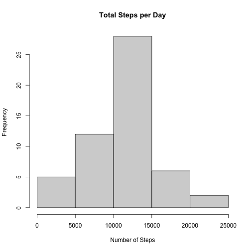
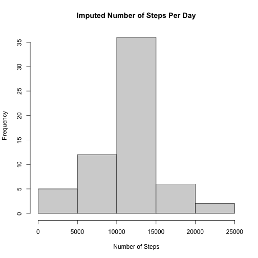

##Loading and pre-processing data:

```r
download.file("https://d396qusza40orc.cloudfront.net/repdata%2Fdata%2Factivity.zip", "activity_data.zip")
unzip("activity_data.zip")
act <- read.csv("activity.csv", stringsAsFactors = F)
```
##Install or load ggplot2


##Convert dates to date format

```r
act$date <- as.Date(act$date)
```

##What is the mean total num. of steps taken per day?

##Histogram

```r
totalSteps <- aggregate(steps ~ date, act, FUN=sum)

hist(totalSteps$steps,
     main = "Total Steps per Day",
     xlab = "Number of Steps")
```



##Mean and median

```r
meanSteps <- mean(totalSteps$steps, na.rm = TRUE)
medSteps <- median(totalSteps$steps, na.rm = TRUE)
```

##What is the average daily activity pattern?

##Time series

```r
meanStepsByInt <- aggregate(steps ~ interval, act, mean)
ggplot(data = meanStepsByInt, aes(x = interval, y = steps)) +
  geom_line() +
  ggtitle("Average Daily Activity Pattern") +
  xlab("5-minute Interval") +
  ylab("Average Number of Steps") +
  theme(plot.title = element_text(hjust = 0.5))
```


##Five min. interval contains max. num. of steps

```r
maxInt <- meanStepsByInt[which.max(meanStepsByInt$steps),]
maxInt
```

##Impute missing values

```r
missingVals <- is.na(act$steps)
```

##Assign Avg. to all NA in new dataset

```r
imp_activityData <- transform(act,
                              steps = ifelse(is.na(act$steps),
                                             meanStepsByInt$steps[match(act$interval, 
                                                                              meanStepsByInt$interval)],
                                            act$steps))
```

###Histogram after missing data is imputed

```r
impStepsByInt <- aggregate(steps ~ date, imp_activityData, FUN=sum)
hist(impStepsByInt$steps,
     main = "Imputed Number of Steps Per Day",
     xlab = "Number of Steps")
```


###Mean/Median

```r
impMeanSteps <- mean(impStepsByInt$steps, na.rm = TRUE)
impMedSteps <- median(impStepsByInt$steps, na.rm = TRUE)
diffMean = impMeanSteps - meanSteps
diffMed = impMedSteps - medSteps
diffTotal = sum(impStepsByInt$steps) - sum(totalSteps$steps)
```

##Create new factor var in dataset with 2 levels: weekend and weekday

```r
DayType <- function(date) {
  day <- weekdays(date)
  if (day %in% c('Monday', 'Tuesday', 'Wednesday', 'Thursday', 'Friday'))
      return ("weekeday")
  else if (day %in% c('Saturday', 'Sunday'))
      return ("weekend")
  else
      stop ("Invalid Date Format.")
}
imp_activityData$date <- as.Date(imp_activityData$date)
imp_activityData$day <- sapply(imp_activityData$date, FUN = DayType)
```

##Make plot containing time series of 5 min interval and average num. of steps taken
##across all weekdays or weekends

```r
meanStepsByDay <- aggregate(steps ~ interval + day, imp_activityData, mean)
ggplot(data = meanStepsByDay, aes(x = interval, y = steps)) + 
  geom_line() +
  facet_grid(day ~ .) +
  ggtitle("Average Daily Activity Pattern") +
  xlab("5-minute Interval") +
  ylab("Average Number of Steps") +
  theme(plot.title = element_text(hjust = 0.5))
```


